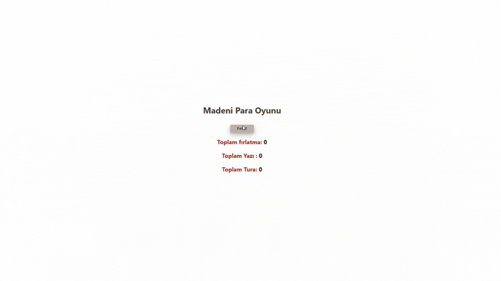

# 🪙 Coin Flip Game

<h1>This is a simple game designed using React with a focus on state and props management. The game simulates a classic Heads or Tails coin flip.</h1>

# 🎮 How It Works:

<h3> A Flip button allows users to randomly flip the coin.</h3>
<h3> Each result, whether Heads or Tails, is stored as a state.</h3>
<h3> The game keeps track of:</h3>

<h4>Total flips</h4>
<h4>Total number of Heads</h4>
<h4>Total number of Tails</h4>

<h1>The flip statistics are dynamically updated, providing real-time feedback on each flip. </h1>

# 🌐 Live Demo

